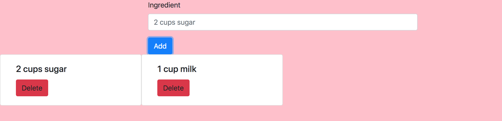
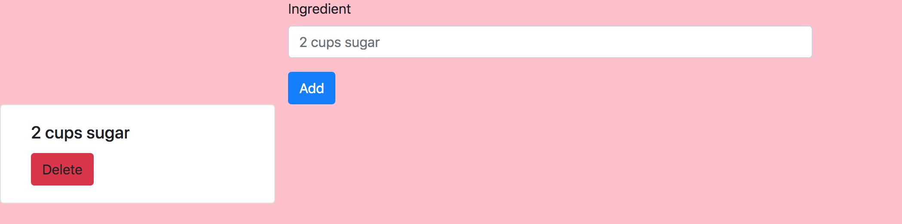

# Pie Builder!

## Description
A simple page that lets you add ingredients onto the page, and delete them if you need.

## Screenshots
Here is page load:

Here is when you add ingredients:

Here is when you delete an ingredient:

## How To Run
1. Go to: `https://www.npmjs.com/package/http-server` and install "http-server".  
2. Navigate to the project folder in command line interface and type: `http-server -p 8080`  
3. This will show at: `http://localhost:8080` in your internet browser.
